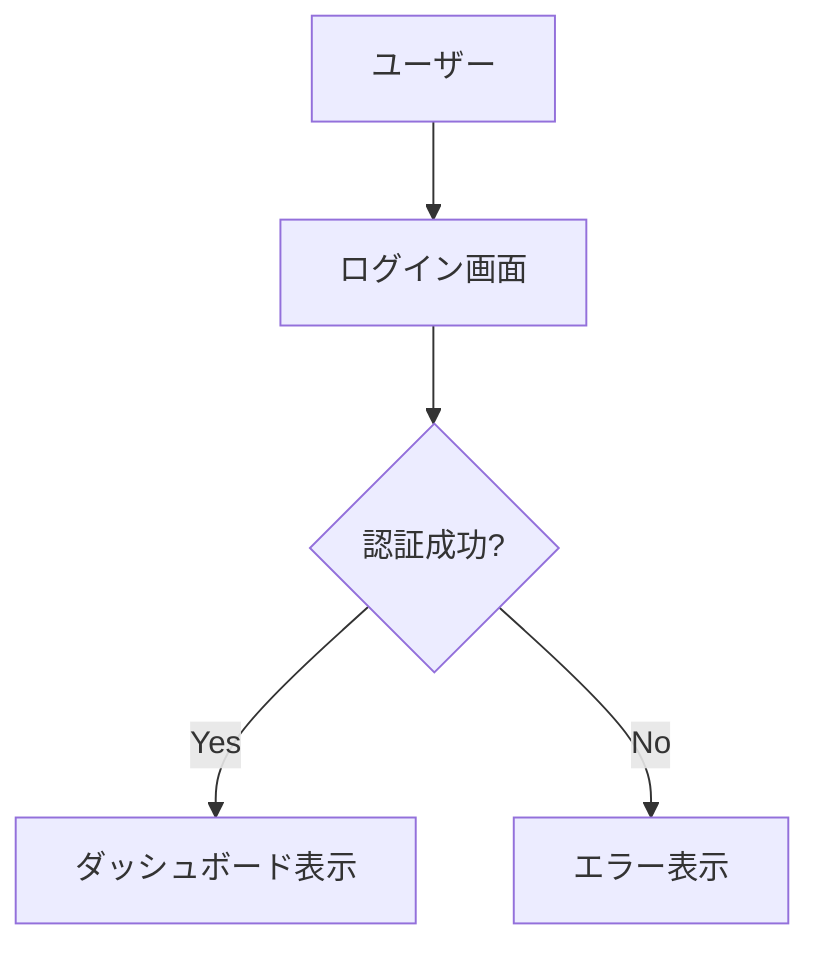
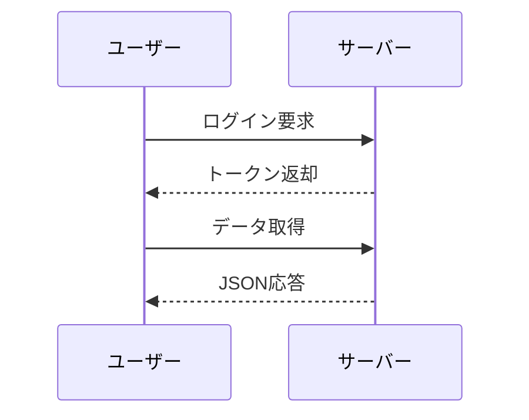
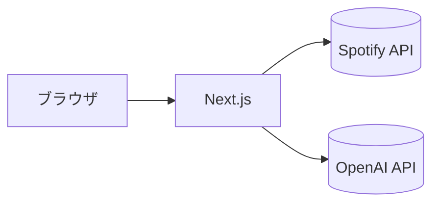

### 🧩 例1：フローチャート

```mermaid
flowchart TD
  A[ユーザー] --> B[ログイン画面]
  B --> C{認証成功?}
  C -->|Yes| D[ダッシュボード表示]
  C -->|No| E[エラー表示]
```

🟢 **flowchart TD** の「TD」は「Top → Down（上から下）」という意味です。  
左から右にしたいなら「LR（Left → Right）」に変えてみてください。

```mermaid
sequenceDiagram
  participant U as ユーザー
  participant S as サーバー
  U->>S: ログイン要求
  S-->>U: トークン返却
  U->>S: データ取得
  S-->>U: JSON応答

```

```mermaid
graph LR
  A[ブラウザ] --> B[Next.js]
  B --> C[(Spotify API)]
  B --> D[(OpenAI API)]
```