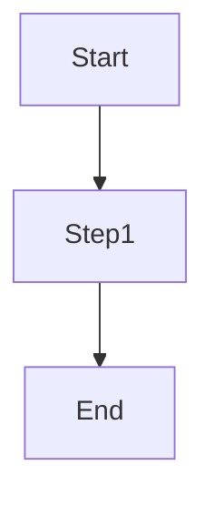

# Markdown 速習チートシート（VS Code 実務向け・日本語）

> **対象**: 記事執筆・開発記録。VS Code + Markdown All in One + Markdown Preview Enhanced + Paste Image 前提。  
> **コツ**: 困ったらプレビュー（`Ctrl + K` → `V`）で確認！

---

## 1. 見出し・段落・強調

```markdown
# 見出し1（記事タイトル）
## 見出し2（章）
### 見出し3（節）
#### 見出し4（小節）

段落は空行で区切る。  
行末にスペース2つで改行。

**太字**、*斜体*、~~取り消し~~、**太字と *斜体* の組み合わせ**。

インラインコードは `code`。
```

---

## 2. 箇条書き・番号付き・チェックリスト

```markdown
- 箇条書き1
  - ネスト1-1
- 箇条書き2

1. 番号付き1
2. 番号付き2

- [x] 完了タスク
- [ ] 未完了タスク
```

---

## 3. 引用・区切り線

```markdown
> これは引用ブロックです。複数行 OK。

---  ← 区切り線（ハイフン3つ以上）
```

---

## 4. リンク・画像

```markdown
[テキストリンク](https://example.com)


<!-- VS Code + Paste Image なら：
  スクショをコピー → 挿入位置で Ctrl+Alt+V → ./images/ に保存＆自動リンク挿入
-->
```

---

## 5. コードブロック

```markdown
```js
// 言語名を指定（js, ts, bash, json, md など）
console.log("Hello");
```
```

> **注意**: 開始の ``` に続けて言語名、終わりは単独の ```（他の文字を付けない）。前後に空行を置くと崩れにくい。

---

## 6. テーブル

```markdown
| 見出し1 | 見出し2 |
|:--      |--:      |
| 左寄せ  | 右寄せ  |
| その2   | 123     |
```

---

## 7. 画像・図の運用（VS Code 前提）

- 画像貼り：`Ctrl + Alt + V`（Paste Image）→ `./images/` に保存＆リンク自動挿入  
- 画像名：`<ファイル名>-YYYY-MM-DD-HH-MM-SS.png` の形式（設定で既定化済み）  
- 相対パス `./images/...` を使うと、フォルダごと移動してもリンクが壊れにくい

---

## 8. 目次（Markdown All in One）

```markdown
[TOC]  ← 後で自動展開する「目次マーカー」
```
- 展開：`Ctrl + Shift + P` → 「Create Table of Contents」  
- レベル範囲は設定で変更可（例：`"markdown.extension.toc.levels": "2..4"`）

---

## 9. Mermaid（図をテキストで描く）

```markdown

```
- 前後に空行。閉じの ``` は単独行。  
- プレビューは **Markdown Preview Enhanced** で開く。

---

## 10. 脚注・注釈（対応ビュー限定）

```markdown
脚注の例です[^1]。

[^1]: ここに脚注本文。
```

---

## 11. 便利な VS Code 操作

- プレビュー：`Ctrl + K` → `V`（Enhanced で）  
- 太字：`Ctrl + B`、斜体：`Ctrl + I`  
- 箇条書き：`-` + スペース（All in One が補助）  
- 目次作成：`Ctrl + Shift + P` → 「Create Table of Contents」  
- スクショ貼付：`Ctrl + Alt + V`  
- 没入（Zen Mode）：`Ctrl + K` → `Z`

---

## 12. PDF 出力（しおり付き）

- プレビュー上で右クリック → **Export (PDF)**  
- しおり（見出しジャンプ）を付けたい：
  - `settings.json` に設定済み（例：`"markdown-preview-enhanced.pdfOptions.outline": true`）

---

## 13. よくあるつまずき

- **Mermaid が出ない**：閉じ ``` が足りない／プレビューが標準側になっている  
- **画像が出ない**：パスが `imagesimages` になっていないか／相対パス `./images/...` を確認  
- **目次が出ない**：`[TOC]` はそのまま置いて、コマンドで展開（自動ではない）

---

## 14. 最小テンプレ（コピペ用）

```markdown
# タイトル
[TOC]

## 導入
本文。

## 本文
### セクション
本文。


## 図（Mermaid）

```
