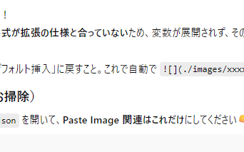
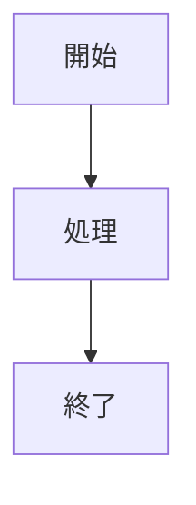

# Markdown動作テスト
[TOC]

## 見出しテスト
本文本文。

### 小見出し
本文。

## 画像テスト（まずはローカル）
ここにスクショを貼ってテスト：
<!-- Snipping Tool でコピー → カーソルここに置いて Ctrl+Alt+V -->
<!-- 例： -->

## 作図テスト（Mermaid）

```mermaid
flowchart TD
  A[開始] --> B[処理]
  B --> C[終了]
```

