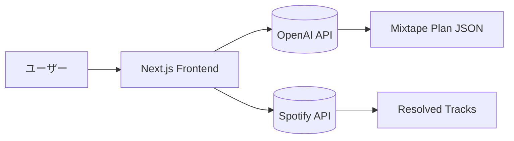

# Project TRIW 開発記録（仮）

[TOC]

## 概要
このドキュメントは、Project TRIW の開発過程をまとめた記録です。  
構想、設計、実装、テスト、改善、公開に至るまでの流れを段階的に整理します。

---

## 1. プロジェクトの構想と目的
- 開発の背景や動機  
- 目指した世界観・体験  
- 企画初期メモや発想の源

> なぜこのアプリを作りたかったのか？ どんな人に使ってほしいのか？

---

## 2. 開発環境の構築
- 使用ツール／技術スタック（Next.js, Node.js, OpenAI API, Spotify APIなど）  
- 環境構築手順（VS Code, GitHub, Vercel, etc.）  
- 初期トラブルや設定の工夫

---

## 3. 設計フェーズ
- 機能構成図（Mermaid 推奨）

- データ構造・API設計  
- 画面構成・UIスケッチ

---

## 4. 実装フェーズ
- 実装ステップの概要  
- 重要モジュール（例：`/api/mixtape/plan`）  
- コーディングの工夫点・失敗談  
- 画面プレビューなどのスクショ

---

## 5. テストとデバッグ
- 実際の動作確認方法  
- アルファテスト／友人テストの様子  
- runlog やエラーハンドリングの工夫  
- Spotify 連携の確認など

---

## 6. 公開とフィードバック
- 初公開までの流れ  
- アルファテストの反応  
- 改善・修正予定  
- 今後の展望

---

## 付録
- 使用したツール／ライブラリ一覧  
- 開発日誌リンク  
- 関連リソース（GitHub, Vercel URLなど）

---

*最終更新：${date}*
