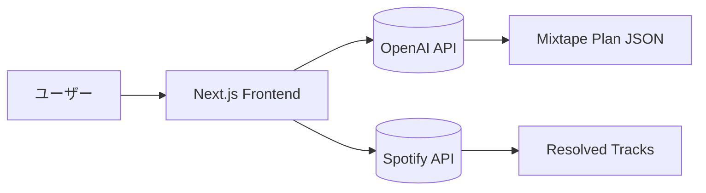

# Project TRIW 開発記録（仮）

[TOC]

## 概要
AIと一緒に生まれて初めてアプリをリリースしました。感動の体験だったのでその経緯をまとめます。

---

## 1. 開発前夜
- もともとのきっかけはSpotifyの曲解説ナレーション作成
  - 2025年6月半ば。Spotifyで気に入ったプレイリストがあってよく聞いていた。曲名とかアーティストとか知らないから確認したいんだけど、そのたびスマホを取り出さないといけない。そういやラジオって曲紹介が入るのがよかったなあ、でもいまそういういい感じのラジオ番組って少なくなっちゃったんだよな。じゃあナレーション入りを作ったらいいんじゃない？
  - まずプレイリストの曲名とアーティスト名を抜き出す方法を考えた。
    - プレイリストをキャプチャして画像にして、ChatGPTにはってテキスト化した。
  
  - 各曲の概要やエピソードをまとめ、紹介用の台本を生成
     
  - 読み上げソフトで音声生成
    - どんな読み上げソフトがあるかをChatGPTに聞く
    - 選定して、作った台本を貼って生成させる
    - 
  
  - Spotify楽曲と生成した音声解説を交互に再生
    - PODキャストで楽曲を挟み込む機能が終了してた
    - 解説音声をアップロード、プレイリストを作って曲と交互に再生させるという手法
    - 
  - 結構おもしろいかも！
    - でも解説文の内容を知ってたらおもしろくない
    - 流れを自動化したいなあ……それってアプリか!?
    
  - というわけでアプリ作成をしてみようと思い立った。

- ChatGPTとのつきあいかた
  - 始めは具体的に作業を指定して頼んでいた。
  - 徐々に相談モードに移行。どんな方法があるかを聞き、メリットデメリットを上げてもらうようになった。
- 

- 企画初期メモや発想の源

---

## 2. 
- 使用ツール／技術スタック（Next.js, Node.js, OpenAI API, Spotify APIなど）  
- 環境構築手順（VS Code, GitHub, Vercel, etc.）  
- 初期トラブルや設定の工夫

---

## 3. 設計フェーズ
- 機能構成図（Mermaid 推奨）

- データ構造・API設計  
- 画面構成・UIスケッチ

---

## 4. 実装フェーズ
- 実装ステップの概要  
- 重要モジュール（例：`/api/mixtape/plan`）  
- コーディングの工夫点・失敗談  
- 画面プレビューなどのスクショ

---

## 5. テストとデバッグ
- 実際の動作確認方法  
- アルファテスト／友人テストの様子  
- runlog やエラーハンドリングの工夫  
- Spotify 連携の確認など

---

## 6. 公開とフィードバック
- 初公開までの流れ  
- アルファテストの反応  
- 改善・修正予定  
- 今後の展望

---

## 付録
- 使用したツール／ライブラリ一覧  
- 開発日誌リンク  
- 関連リソース（GitHub, Vercel URLなど）

---

*最終更新：${date}*
