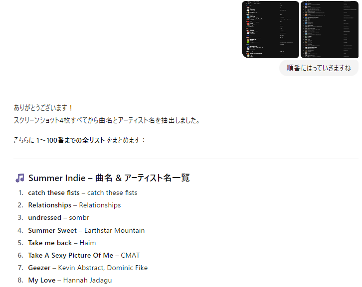
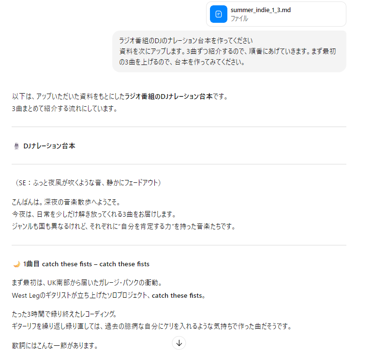
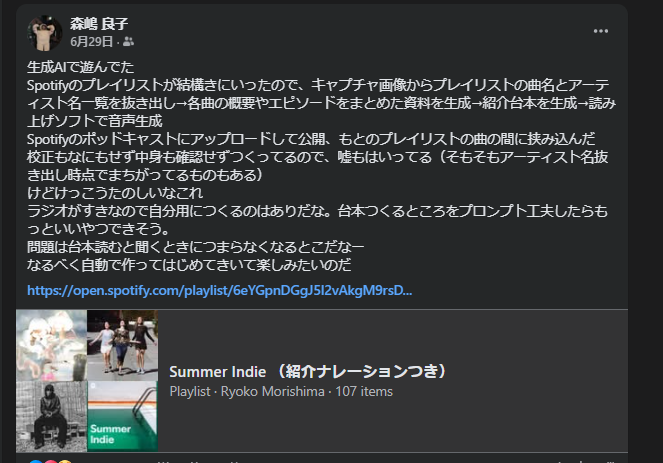

# 1. 開発前夜（6月半ば～後半）
## きっかけはSpotifyの曲解説ナレーションがほしかったこと
   2025年6月半ば。Spotifyで気に入ったプレイリストがあってよく聞いていた。曲名とかアーティストとか知らないから確認したいんだけど、そのたびスマホを取り出さないといけない。そういやラジオって曲紹介が入るのがよかったなあ、でもいまそういういい感じのラジオ番組って少なくなっちゃったんだよな。じゃあナレーション入りを作ったらいいんじゃない？いいんじゃない！？
 
## SpotifyのPodキャストを作ろうと思った
   - まずセットリストを抜き出す。
   たしか曲を読み込めるPodキャストがあったはずなので、台本つくればいいんじゃないかと考えた。
   まずプレイリストの曲名とアーティスト名を抜き出す方法を考えた。
     プレイリストのURLを貼ってテキスト化を頼んだがうまくいかない。どうしたらいいかChatGPTに聞いたらキャプチャ画像を貼れという返事が。なるほど、OCRができるのか。
     
  

 
  - 各曲の概要やエピソードをまとめ、紹介用の台本を生成
  こういうのはおそらくAIが得意な分野なので、ここでChatGPTを使ってみようと思った。ChatGPTの過去ログを見ると、まず各曲の資料作成を行い、それを基に各曲の紹介文を生成させていた。このあたりよく覚えてないけど、どんな紹介ナレーションがうれしいかを考えていたようだ。曲名とアーティスト名は必須、あとは曲の一節を抜き出すとかグループの国とか、特徴的なエピソードとか。そのためにたぶん基礎資料を作るという手法になったんじゃないかな。結構ナレーションっぽい文章を作らせるのに四苦八苦している。
    - 

  - 読み上げサービスで音声生成
    これを音声化するため、読み上げソフトをChatGPTで調査。台本（テキストファイル）を手動で読み上げサービスに入れて音声ファイルを作った。
  
  - ナレーション音声をSpotifyにアップ、手動でプレイリスト作成
    なんと！　SpotifyのPodキャストの曲読込機能が終了していた！　愕然。
     しかたなく、1曲ずつ解説ナレーション音声を作って交互に再生させる方針に変更した。
     プレイリストで対応。なんかそれらしくなった。
     Facebookの履歴↓
     

##   よし、本格的にやるか
 ひとつずつファイルを作成するのはめんどくさい。しかも自分で聞いて楽しみたいのにあらかじめ内容知ってたら面白くない。
  最近ヴァイブコーディングとやらが流行ってるらしいし自動化やってみるか？
  というわけで自動化をしてみようと思い立った。

