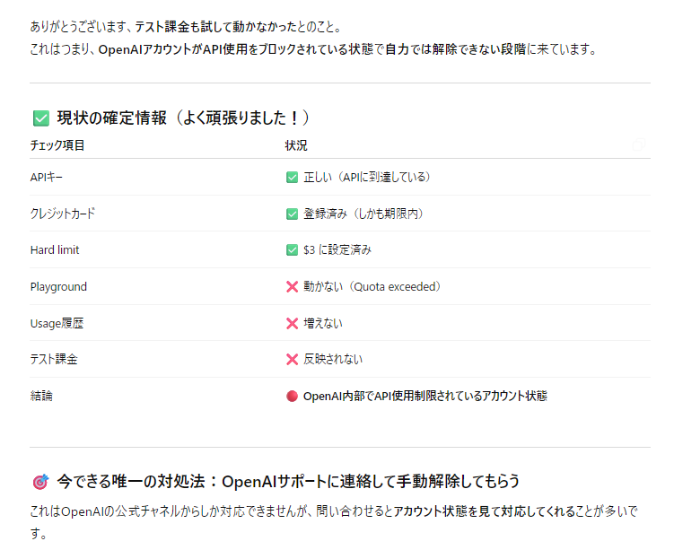

#　2 開発のはじまり（7月初旬）

## 気軽にはじめてしまった
 ヴァイブコーディングについてはあまり調べなかった。ChatGPTにやりたいことを気軽に頼んでみることにした。まずは自分の作りたいものを書く。そのために、どういうアプリがあったらうれしいかを考えた。これはつらつらと人間が考えています。そしてそれをまとめ、実現するための手順を聞いた。

すぐ返事が返ってくる。

 

 

 

 いや、フェーズとか言われても……。えっこんなに本格的なの。ちょっと待て。ここは正直にこちらのスキルを伝えなければ。
 

  ミニゴールっていいですね。じゃあやってみるかな。
  相談して最初に作ってみようといわれたのがこれ。
 

  
## 初めてのAPI
 おおーAPIがでてきた！　憧れのAPI！　API叩けるようになったらなんでもできるぞ！
 もちろんAPIなんて使ってみるのは初めてなので、APIの使い方を逐一聞きながら進める。
 HTMLファイルも出してもらってローカルに保存、ブラウザで表示すればいいらしい！
 

 
が！動かない！

 先に言えや！！！
 

ほんとだな。じゃあおすすめにします。

## 初めてのサーバー立て
 ChatGPTのいうことにゃ

 まあそうですよね。サーバーたてなきゃ動かないよね。
 しかし5分てどこから来たのか。気軽に言うが、言われたとおりやっても動かない。このあたりからだんだんChatGPTの「5分でできます！」はあやしいと思い始めてきた。動かないといったら「Windowsだとだめかも」という。方法を聞いたら別のコマンドを教えてくれた。幸い私はpythonを入れてあったので起動した。

 
  
## 初めてのエラーつぶし
  ChatGPTと開発していくときに欠かせないのがエラーつぶしだ。というかこれが主かもしれない。
  いわれるがままにここまで進めてきたが、開発らしきものをやっていくとなるとここがポイントらしいということがうすうす見えてきた。

  1. うまくいかないことをChatGPTに人間が伝える
  2. エラーの確定をするための方法をChatGPTが指示
  3. 人間がそれを実行して結果をChatGPTに教える
  4. ChatGPTが修正案を出し、それをまた人間が実行
  5. うまくいくまでくりかえし

  ファイルを作り、指定のところに置いて実行してアクセスしてみるが、まあ思った通りには動かない。次に指示されたのが「ブラウザ開発者ツールを開いて確認せよ」。もちろん、ブラウザ開発者ツールも使ったことないので、開き方から見方まで全部聞く。
  しかしまだ解決できない。エラーを究明するためにログを出させるコードも修正してほしいと言ってきた。こういうやつ↓
  

  

  
 とにかく、いわれたままにコードを人間が書き換え、実行して結果を伝えます。

 ほめてくれてありがとう。んでもってこれを修正するためのコードがでて、書き換えて、というのをがんばっていきました。

## API利用開始トラブルの解決
 

 きりがない……。
 こんな感じで延々続くエラーをつぶしていきます。API使うのたいへんですね。
 結局の結論は。
 

 こんなんわかるか。これ、普通に自分でやってたら絶対解決できなかったと思います。そのあと、サポートページで解除するための方法と申請文も出してくれて、さらにそのあとのやり取りも頼んで解決しました。
 

 

##　テキストからの音声生成を実現する
 さて、APIの利用ができるように準備が整ったので、本筋の開発を続けます。目的は音声ファイルを生成するところまででした。
 具体的にどうやって音声化するかをまず相談します。
 

 Google Cloud　TTS APIを使うことにします。すでにOpenAIのAPIを使うときにエラーを解決した経験があるのでここはわりとすいすいとエラーを解決できました。

 API連携はうまくいったものの、期待通りの音声ファイルができない問題が発生します。すでにナレーション台本を作る基本的な流れは考えていたものの、台本に余計な指示や記号が入ってしまってそれが取れない。TTSは忠実に「カッコ」とかまで読んでしまう。
ChatGPTのプロンプトの問題なので、プロンプトを試行錯誤し、さらに最終的には力業ではずす（Javascriptで）という解決をしました。
  
  
## UIもつけてみる。動いた！
 エラーが解決できたので、全体で動かしてみることにします。HTMLを出してもらってファイルに保存、さてブラウザからアクセス。
 

 どうやらいっぱつで動いた模様
 

    
 まあまあ苦労したものの、結構すんなりと進みました。とにかくやるべきことをどんどん教えてくれるので、それに従って行けばうまくいくような気がしていました。なんつってもAPI使えるようになったしね！　夢が膨らみます。

  
