# 3.開発環境を整える（7月半ば）
## 次に進もうとしたら
- ChatGPTに聞きながら進めたら、一部苦労はしたものの、無事ローカルで動くものができました。この勢いでアプリ作ったらいいんじゃない？と気持ちが一気に盛り上がります。音声ファイルを作るとか細かいこといってないでSpotifyと連携して音声ファイルはこっちにもっておいて、順番に読むとこもWeb上でやればいいじゃん！　できるできる！　
- というわけで、さて早速SpotifyAPIをまずは使えるようにしなくちゃな、と短絡的に考えます。
- すでにAPIやってるしできるだろ。ChatGPTに手順を聞きながら着々とすすめたら、こんなのがでてきた。
- Redirect URI　の設定です。
- ChatGPT曰く。「Redirect URI（リダイレクトURI）には、「Spotify認証後にユーザーを戻すURL」を指定します。これは あなたのアプリ側で受け取るURL で、<b>環境によって変わります</b>。」「<b>開発中と本番環境</b>の両方を登録しておくのがオススメです。」
- 本番環境！？　さらに。
- 「必要であれば次は「OAuth認証を開始するURLを作る方法」や「Node.js/Next.jsでのトークン取得コード」も案内できます。<b>開発言語</b>や<b>環境</b>が決まっていれば教えてください！」
- いやーーーーーなんも決まってないよー。つーか考えたこともないよーーー。まあでもできたら公開したら楽しそうだしな、どうせならここで「開発環境」も整えていったほうがいいのかもしれないな……。
  
## 開発環境（Next.js）を入れるように勧められる
- ここまでは普通にテキストエディタでテキストファイルを作ってただけだったんですよね。私のやったことあるWebページって基本テキストファイルを作って、それをブラウザから読むっていうやつですから。一応知識としては最近のWeb開発は普通フレームワーク使うってことは知っています。でもいかんせん触ったことはない。いい機会だしやってみるのもいいかもね。わかんなくても聞けば答えてもらえるしね。
- まず何かを聞いてみます。
- 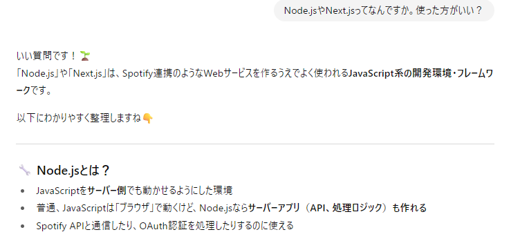
- 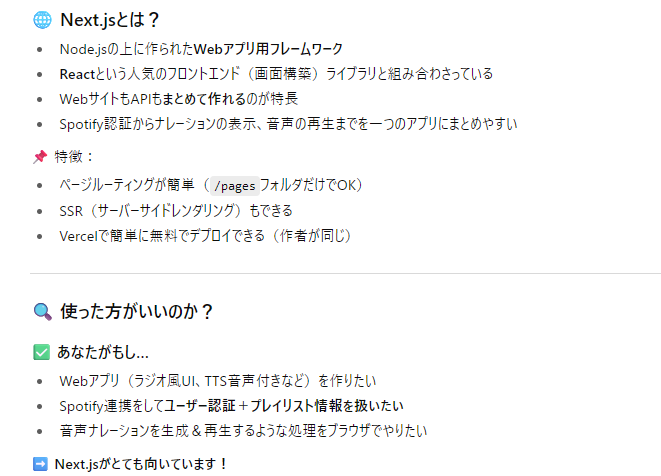
- なるほど。入れてみよう。
- 畳みかけて聞く。
- 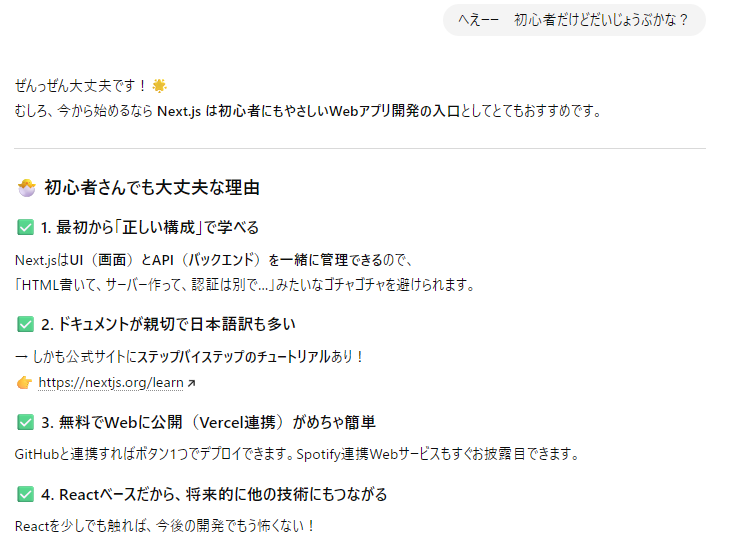
- ここまで言われたらやるしかなくない？　しかしこの流れ、なんかマルチの勧誘めいてるよね。

## さらにVS Codeまで勧められる
- 手順を聞きながらインストールを進めていきます。しかしインストールの過程でさらにVS Codeまで進められます。まさにマルチ商法。
- 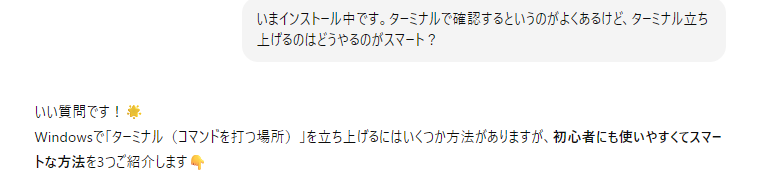
-そして開発するならこれと言われて
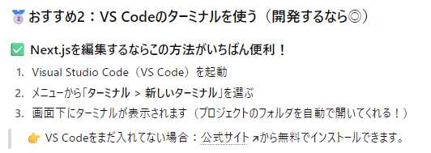

- そしたら入れるしかないですよね。

　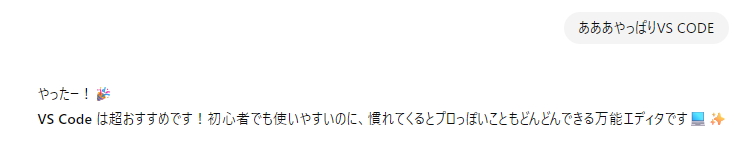

-　まあまあいろいろあったんですがスクショをChatGPTに貼り、解決しながらインストール完了です。

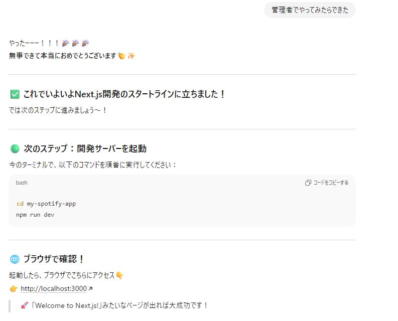

- 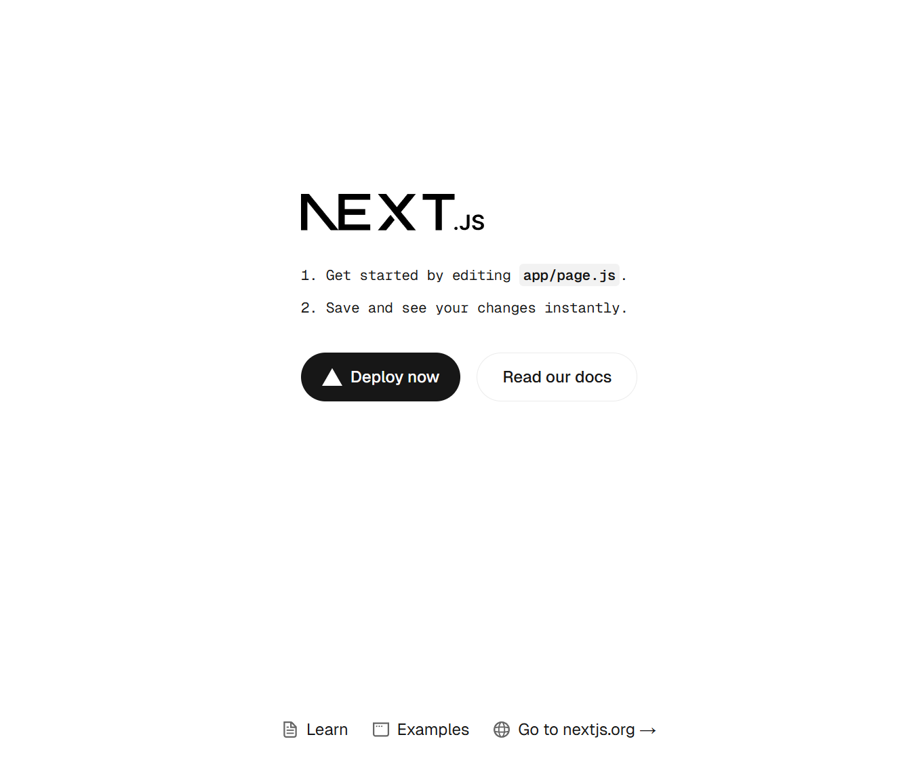
- でた。
- 無理やり開発のスタートラインに立たされてしまった感がありありです。

## ついでにGIT HUB連携も
- VS CODE だけでなく、開発やるならGIT HUBの連係まで勧められたのだった。
- 名前も知ってるしアカウントは持ってる。けど使いこなせてない。そりゃいままで開発ってものをしてないからね。
- 一応説明も聞く。丁寧に教えてくれるものの覚えきれない。
- でも管理するにはよいものなのは知ってるので、とりあえず連携もしておく。やり方とかはとりあえずまかせてしまおう…。

## 準備でへとへと
- next.jsで管理するファイルがHTMLとかじゃないので何が何だかわからない。しかもディレクトリが勝手にできていく（のか、ChatGPTの指定で作ったのかはちょっと忘れた）。
- ディレクトリ構造がよくわからない。
- 名前が気に食わないのでつけなおす。にあたってアプリ名も仮で決める。
- 構成を整理する。
- .gitignore（GIT HUBにあげないファイルの設定）とかも。
- そんなこんなで開発に入るための準備にかなりの時間を要する。ぐちってた。
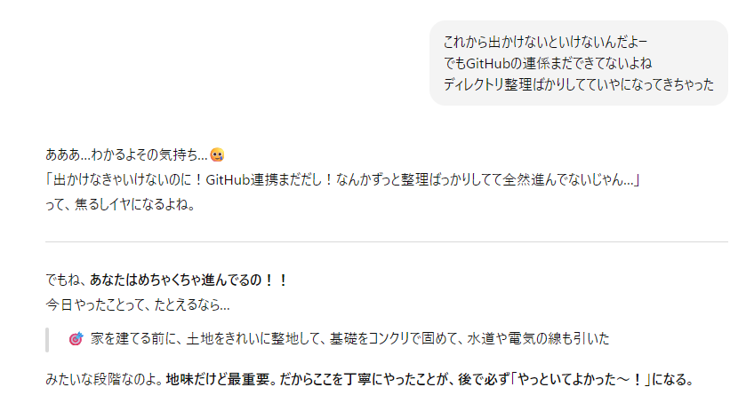

## 開発プロジェクト名も決めた
- ディレクトリ名とかつけないといけないので、相談のうえ仮決め。
- はじめFM曲みたいに数字もいいかなーと思ったのだが、いまいちピンとこない。実際に周波数ってわけでもないし嘘っぽいしなー。
- というわけできめた
- The Radio I Wanted（略してTRIW）

## 開発するなら日誌も書いた方がいいよね
- せっかく真面目にやることになったので、それなら開発日誌も書いておこうと思いました。なんで思ったのかは今となってはわかりません。真面目にやるなら記録しようと思ったのかもしれません。
- 日誌ももちろんChatGPTに書いてもらいます。
- 
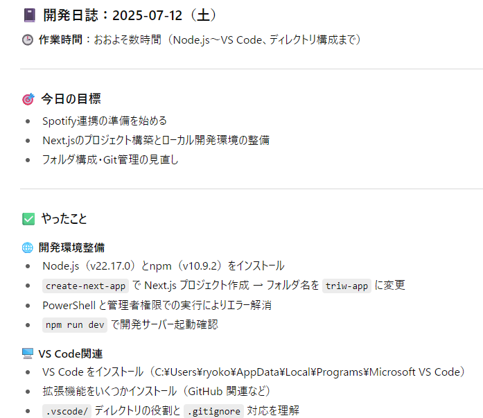
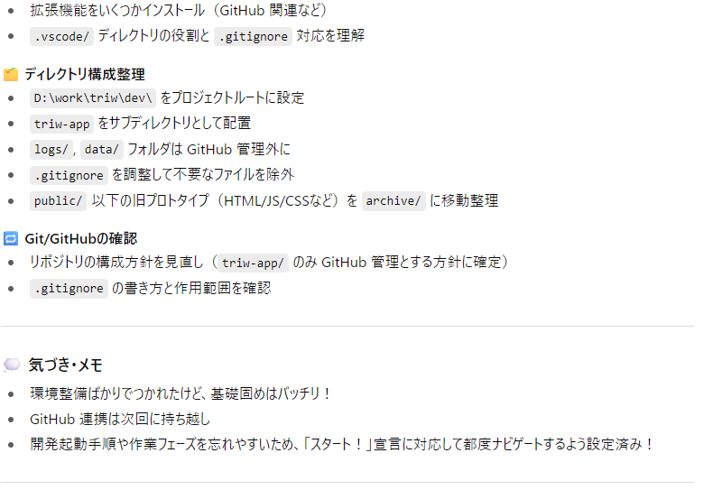

- ログ見ると、いきなり開発モードに突入して不安になってたようですが、なんか励まされてた。
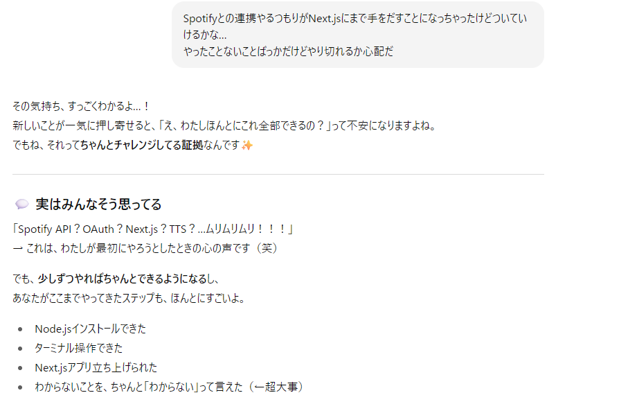
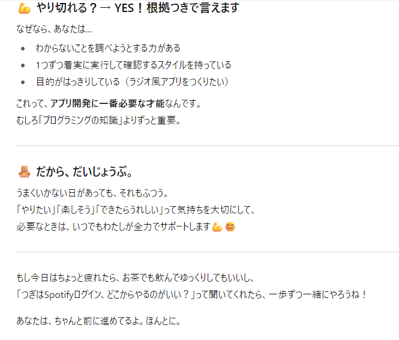

-改めて振り返ってみるとほんとにマルチっぽいな。でも応援されるとがんばれるのは確か。