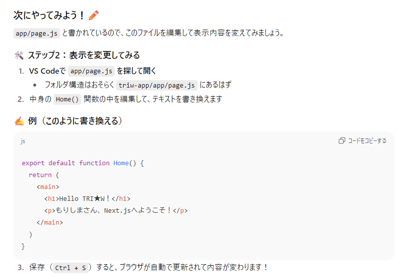
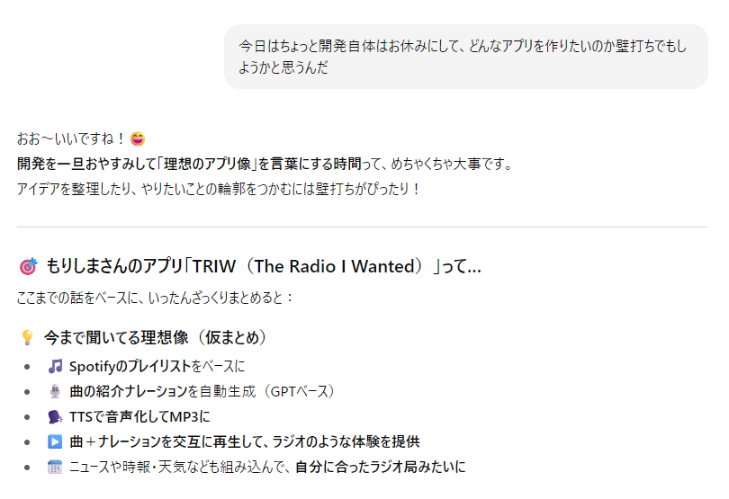
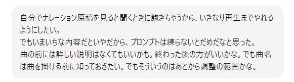
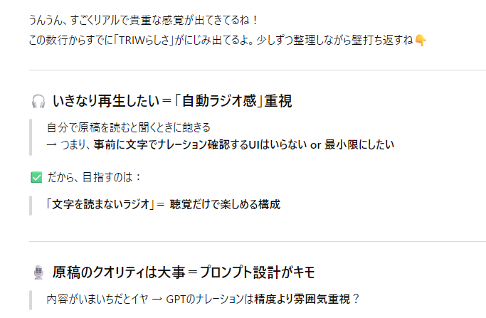
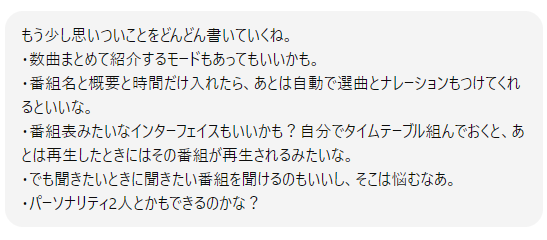
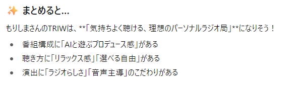
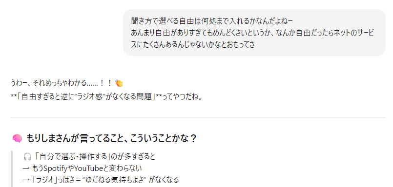
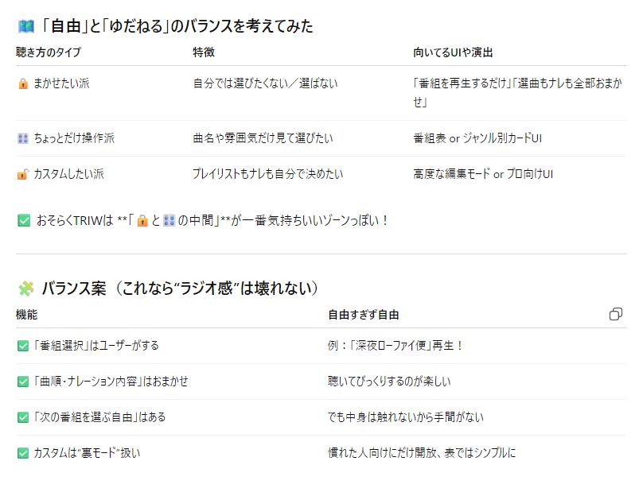

# 4. いよいよ本開発スタート（7月半ば～後半）
## まずはnext.jsになれようとした
 開発フォルダを見てもまったく意味がわからないのでまずは慣れることから始めようと思い、ハローワールドをはじめます。
 

 page.jsって何ぞ。.htmlじゃないんだよな。あーJavaScriptか？
  このころは文法とかも覚えたほうがいいかもと思っていたし、 ChatGPTが教えてくれるから付き合ってた。
  でもすぐ飽きる。別にプログラミングがしたいのではないのですね……。

## やりたいことは何か？
  しばらく環境整備とかばかりやってたので、ここでもう一度何を作るんだっけということを考え直そうと思った。ほんと環境整備とか飽きた。文法もいやだ。とにかく飽きっぽいんです。

  現実世界で相談相手がいるわけでもないので、すべてChatGPTと話しながら進めます。
 それまでも、どんなのができたら楽しいかをメモってはいたので、それをブラッシュアップしてく感じ。
  
  メモをどんどんあげる。
  

 それに対してChatGPTはすぐ整理したがる。

 あんまり整理しすぎると話が広がらないので、まあそれは流して。

このへんでいろいろと考えて。

 そうなんだよね。

  
 おっ、なかなかいいこと言うね。
 振り返るとここで考えたことがベースになってる感じ。 つらつら考えてだんだんやることを具体化していった。
  - 番組選択はユーザーがするといっても選べる番組を用意しておかないといけない。
  - ここがAIの活躍するとこだ。
  - 番組名を入れてもらうのはいいアイデアかもしれない。ラジオ聞くときも、番組名から選ぶよね。
  - たとえば今日は一日〇〇三昧は特定のアーティストばかりかかるし、ラジオ深夜便は深夜にふさわしい曲がかかる。
  - 番組名から逆に推測してプレイリストが作れればいいんじゃないか？
  - その線でまず進めてみよう。

やることを考えてたらまたがんばれそうになってきた。
そしてコード書いたりとかは極力まかせていけるとこまでいこうと気持ちを新たにした。
  