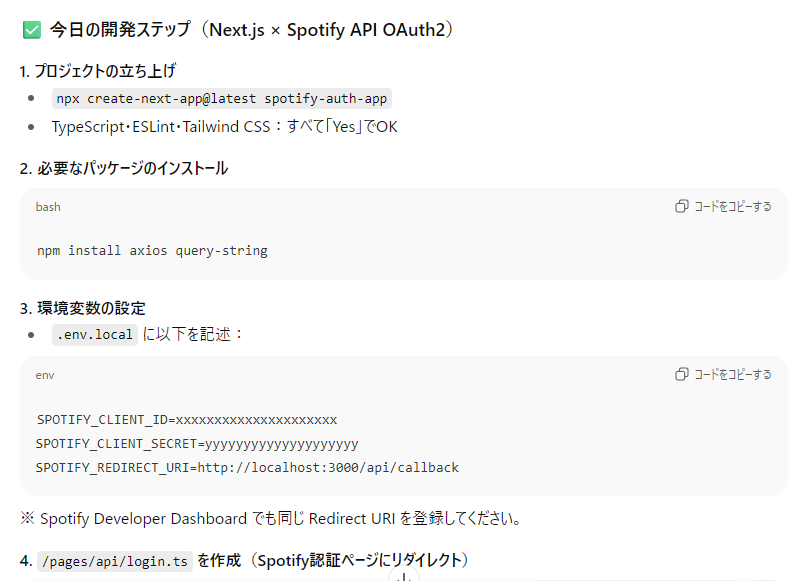
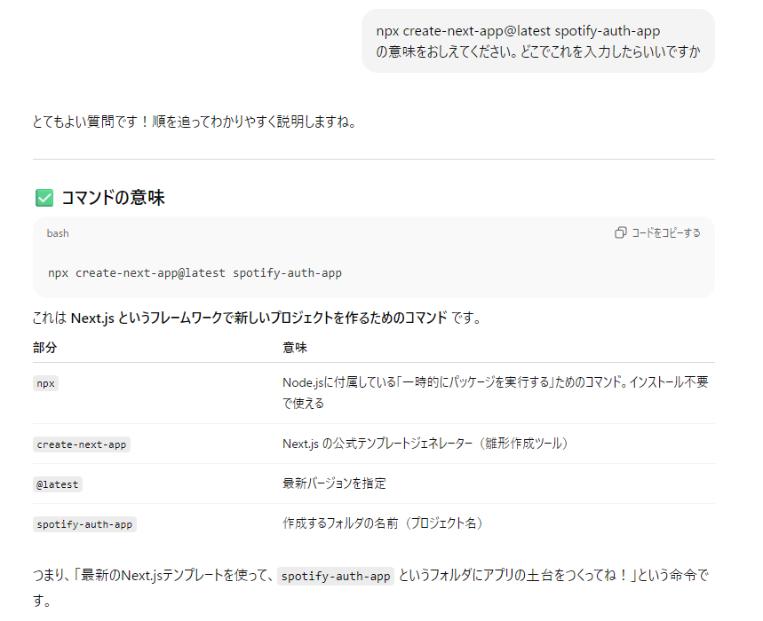
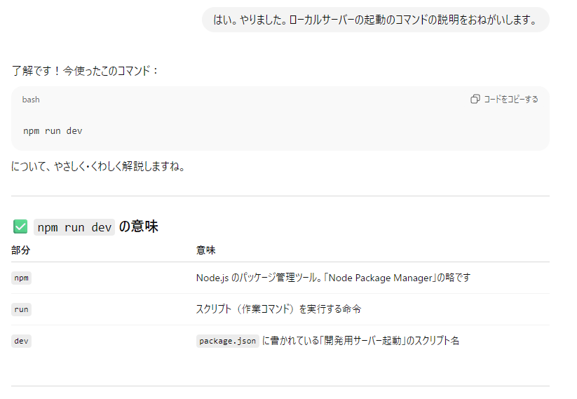
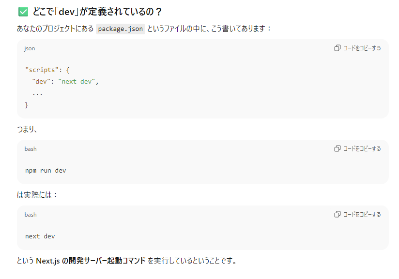

# 5. Spotify連携の壁（7月後半～8月上旬）
## Spotify APIは手ごわかった
- OpenAIのときはすんなりいったけど、Spotify APIを使うためにはいろいろ設定が必要で大変だったのだ。
- もう何が大変だったのか思い出せない。しかしちゃんと開発日記がある！
- それを見ると、まずSpotifyのAPIを試すところから始めたらしい。
- 
- ### 📓 開発日誌：2025-07-26（土）
- #### 🎯 やったこと
  - Spotify Web API の認証・推薦APIの動作を Postman で本格的に試行
  - トップアーティスト取得API（`/v1/me/top/artists`）のレスポンス確認
  - プレイリスト生成に向けて `/v1/recommendations` を試したが、パラメータエラーなどに苦戦
  - seed_genres や target_valence などのパラメータ指定に失敗し、エラーを調査
  - アクセストークン取得のトラブル（Web API Console で Get Token が表示されない）

- #### 🛠 課題と対応
  - API Console が使えないことを確認し、今後は Postman 経由の認証を主軸にする方針に変更
  - Postman の Authorization タブや Header 設定に慣れてきた
  - 将来的には Postman を使わず、Webアプリ内で Spotify API を使えるようにしたいと思った

- #### 💬 感想・次へのステップ
  - 目的のプレイリスト推薦APIが正しく動かず悔しかったが、Postman操作には自信がついてきた
  - 次は Spotify 認証を Web アプリ側で処理できるようにサンプル構築へ移行予定

- 開発日誌の課題と対応はなんか嘘っぽいな。これはSpotify利用のためのテストみたいなもんなので、ここまで必死になる必要があったのかはいまとなっては疑問だ。しかしこのやりとりほんとに大変だった。しかもそのあとPostmanも使ってない。

##　本来やりたかったWebからの認証を動かす
- 本来Webから認証できりゃいいので、そっちに移行。
- おお、認証するには新しくパッケージの追加インストールが必要なのか。
- 
- ほかに、login.tsとかcallback.tsとかを作るように言われるのでコピペで作る。
- なんかtsとtsxってのがあるのだな。
- この時点では、コマンドを入れるという意味もよくわからず。
- 
- しかもいったんやってるけどまた忘れて聞いてる。というか書いてる今もまた忘れてた。
- 
- 
- ログインボタンを表示するコードも出てきた。コピペで作成。これがUI作成つうやつか。
- やはりいろいろとエラーは出るがそのたび聞いて修正、聞いて修正、のくりかえし。
- このあたりでディレクトリがずれたりとかいろいろ起こる。ファイルがないってやつ。
- 完全にここで泥沼に陥った。日誌の日付を見ると前回のテストから10日間空いてる。
-
- ## 📓 開発日誌：2025-08-07（木）

### 🎯 今日の目標  
- Spotify認証連携の動作確認（`signIn('spotify')` でログイン）
- Next.js アプリの起動と `.env.local` の環境変数確認
- 認証後の動作（リダイレクト）までつなげたい！

---
### 🛠 やったこと（順番に）

#### ✅ Next.js 開発サーバ起動
- `npm run dev` 実行し、正常に `localhost:3000` で立ち上がることを確認（最初は成功）
- 一度ポート競合でプロセス強制終了→再起動（成功）

#### ✅ `Sign in with Spotify` ボタンの動作確認
- `signIn('spotify')` ボタンを実装
- クリック時に `process.env.SPOTIFY_CLIENT_ID is undefined` エラーに遭遇 → 環境変数の読み取りミスに気づく

#### ✅ `.env.local`の整備
- 以下の内容をしっかり記述：
  ```env
  SPOTIFY_CLIENT_ID=（本物）
  SPOTIFY_CLIENT_SECRET=（本物）
  NEXTAUTH_URL=http://localhost:3000
  NEXTAUTH_SECRET=（ランダムな長い文字列）
  ```
- `console.log()` で `CLIENT_ID` / `SECRET` が読み込めていることも確認

#### ✅ `next-auth` インストールと `[...nextauth]` 実装
- APIルート `app/api/auth/[...nextauth]/route.ts` を作成（App Router構成）
- Spotify プロバイダの認証設定を追加
- 認証処理自体は `200 OK` が返るように見えた

---

### ⚠️ ハマったポイント

#### ❌ `INVALID_CLIENT` エラー
- Spotifyにリダイレクトすると `INVALID_CLIENT` 発生
- 原因：**Spotify Developer Dashboardで`localhost`が使えない**（`This redirect URI is not secure` エラー）
- 対策として `127.0.0.1:3000` をリダイレクトURIにしたが、挙動不安定

#### ❌ `localhost:3000` に突然アクセスできなくなった
- 開発サーバは起動しているのに、ブラウザでページが表示されない
- キャッシュやポート、リダイレクトの問題など複合的に絡んでいる可能性
- `127.0.0.1:3000` にもアクセスできない状態に

#### ❌ 状況が複雑化して、何が原因かわからなくなってしまった
- `.env.local`、コード、ブラウザ、リダイレクト、すべてが絡み合い迷子状態に
- 精神的にもくじけそうになり「いったん最初からやり直したい」と判断（←賢明！）

---

### ✍️ 明日以降やること（再スタート）

1. **Pages Routerで最小構成からやり直す**
   - `npx create-next-app` → Pages Router を選択
2. **SpotifyリダイレクトURIは「127.0.0.1:3000」形式で登録**
   - `localhost` は使えないことを忘れずに
3. **`signIn('spotify')`だけのシンプルな構成でまず1回成功させる**
   - 動いたらそこから順次機能追加

---

- うーむなかなか手ごわい。
  


