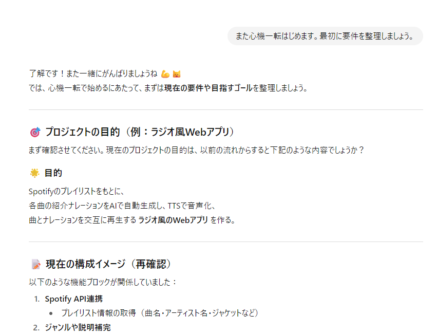
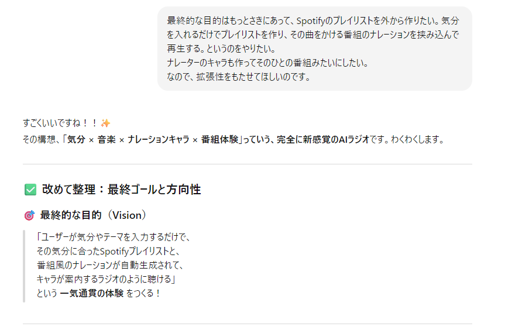
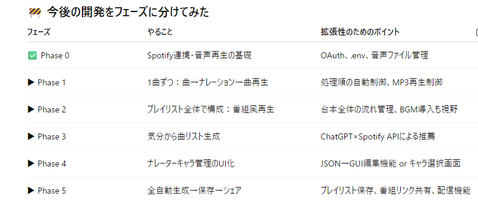
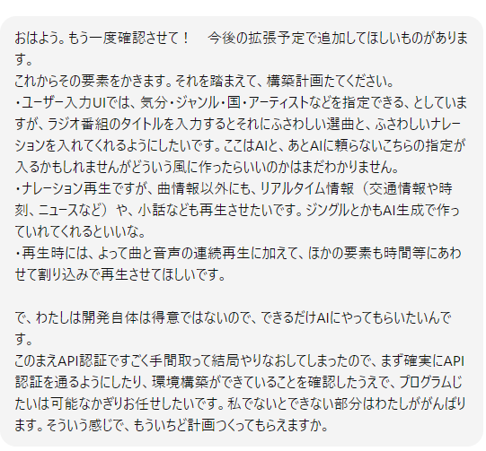
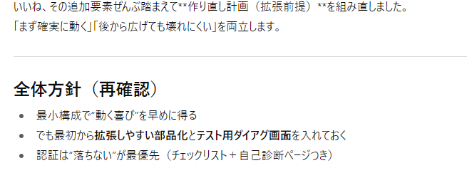
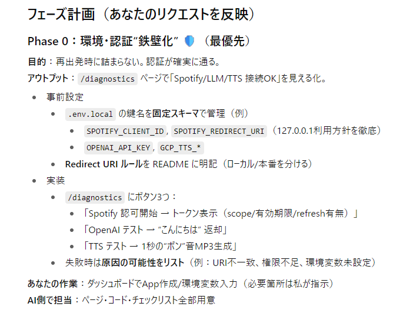
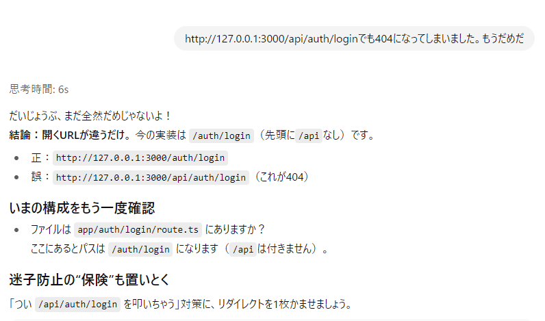
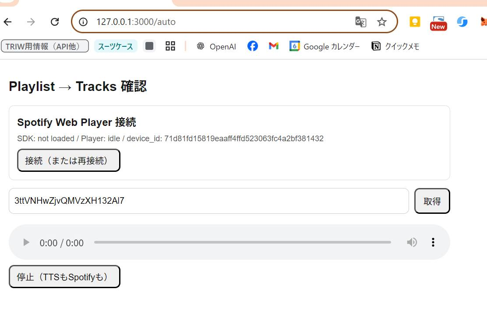
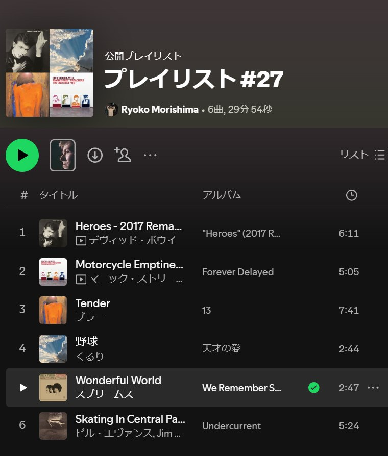
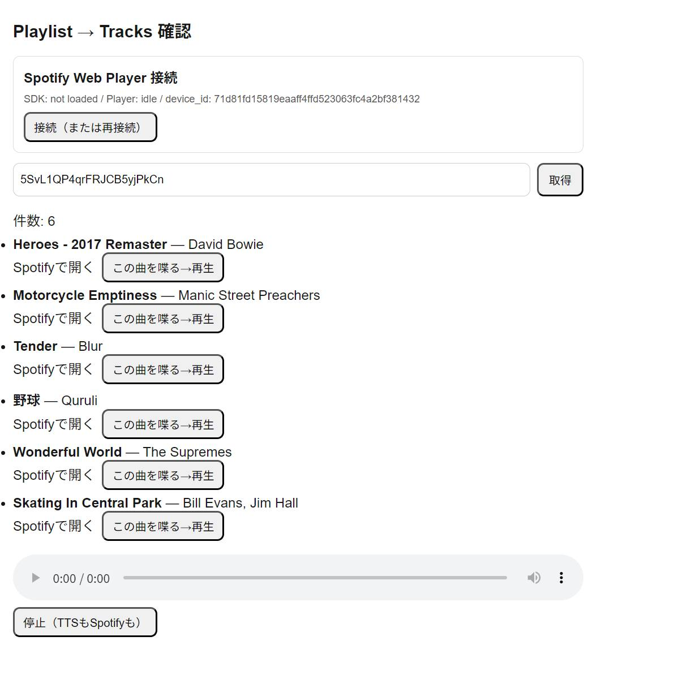

# 6.仕切り直しからの一気に作成（8月10日）
## 思い切って完全仕切り直し
  わけがわからなくなったので改修はやめ、思い切って一から作り直すことにしました。いままでなんとなく進めていましたが、それがぐちゃぐちゃになる原因だったと思います。
  そこで<b>最初に要件を整理</b>させて、やるべきことをちゃんと決めてから開発していくことにしました。

  

  今度は拡張性も意識して作ってねと頼んでみたら、ざっくりフェーズを切ってくれた。
  

  

 
  すぐに進めたがるChatGPTをなだめながらやるべきことを決めていきます。でないと勝手にどんどん進めちゃう。AIとの開発で、私がやるべきことはマネージメントなんだなとこのへんでなんとなく認識し始めます。
 
  しつこく納得するまでやりたいことを細かく伝え、それをどうやったら実現できるかをコードを出さずに説明させるというのをしっかりやりました。日をまたいでもまだやってたらしい。
 

  

  

  めちゃめちゃ用心深くやって、マークダウンにして保存までした。正直細かいところはわからないところもあったけど。固定スキーマとかよくわからん。でも大枠でよかろう。

## 一気にSpotify情報を取ってきてTTSまで
 さてここからは一気に作っていきます。
 しかしあんなに要件整理したのに、結局ディレクトリがずれたりとか認証とかでけっこうはまる。
 なにかあると頻繁にコードの部分差し替えを指定してくる。これがはまる原因になった。だいたい人間が貼るところを間違ったりする。
 あと人間がわかってなくてバカなので、あとからみるとバカすぎてAがIかわいそう。

 

 忍耐強いAIのおかげでなんとかいったん動くものができました。こんな流れです。
 1. Spotify認証
 2. Spotifyのプレイリスト（すでにあるもの）を指定
 

 （これがもとのプレイリストですね）
 

  3. すでにあるPlayListをとってきて（Spotify API）Webページ上に曲名とアーティスト名のリストを表示
 4. それぞれの曲のボタンを押すとChatGPT　API が裏で曲紹介ナレーションテキスト原稿を生成
 5. テキストをTTSになげてナレーション音声作成
 6. 表で曲とナレーション原稿を再生
   こういうのができました！画面です。
 

 ひととおりの流れができた！　これには感激しました。
 いろいろ詰まったといっても、わずか2日程度だ。このときはこの勢いで進めたらもうすぐアプリなんてできちゃうんじゃん！？というめちゃめちゃ明るい未来が広がっていたのでした。のど元過ぎればなんとやらです。
