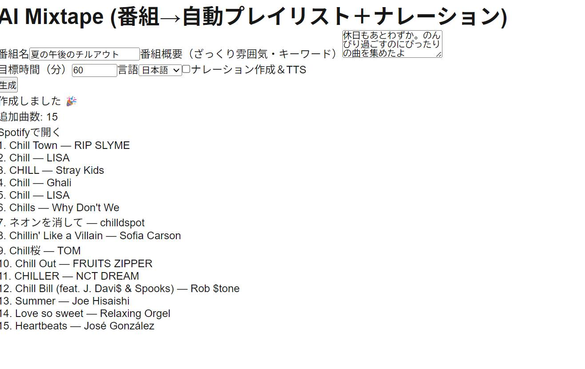

# 7. 沼る予感からの再々起動（8月11日～25日）
## プレイリスト作成機能を追加しよう
 動いた！やったー！じゃあどんどんいくよ！　という勢いで、機能追加に取り掛かりました。フェーズでいうと、次は既存のプレイリストではなくてオリジナルのプレイリストを作らせるところです。
 枠組みづくりは結構すんなりできました。
 しかし満足いくリストを作らせるのがとても難しい。
 こんな感じで、チルアウトという番組名を指定するとその言葉にひっぱられた曲名しか出てこない。

こりゃだめだ。
  
 曲を選ぶロジックに問題があるみたいで、ChatGPTに作らせたら、キーワード検索とか、ジャンル＝〇〇とかの厳密な指定を基にしてSpotifyで該当曲をひっぱってくるみたいなことをしてしまうのです。

 ここでLLMをうまく使うのがプレイリストのポイントになりそう。自分もLLMなのにLLMを積極的に使おう！ってならないんだよね。面白いね。

 面白いけどやっかいで、自然言語で扱いたいのにすぐにデータ化をしたがる。変数に数字やキーワードを入れたがる（人気数値〇〇以上のもの、とか）。
そこの根本的なロジックを変えたがらないので、ちょっと変えたら今度は選曲数がゼロとかになってしまう。 

うーんこれはやり方変えないとだめだな。というわけで、ここは人間が考えます。
選曲というのは結構感覚のものなので、そこはあまり数値化しないで進めるように明示的に言ってロジックを変えてもらいました。Spotify内のデータに頼らずLLMに候補曲を出してもらい、それをSpotifyに問い合わせて実在するものをピックアップする方針に変更しました。
  
まあでもなかなかうまくいかないね！

うなってたら、途中の選ぶ過程をJSONで出すデバッグ機能を追加してくれましたた。これは助かる！　過程みながらどうするかプロンプトを考えていくことにします。
  
  
## 再度作り直し
そんなかんじで、結構でかい修正になるので、また泥沼にはまりそうな予感があり、作り直すことにしました。
なにしろコードの中身をちゃんと把握していないので、改修に自信が持てないのです。
でもちゃんとした指示さえすれば、整合性の取れたちゃんとしたコードをすぐに出してくれるので、へたに改修するよりそれのが品質もいいし早いですね。

ただ、いままでやった経験も使えるはずなので、それを生かす方法を考えました。
いままではまったポイントのメモ（作業日報）とか、使えそうなコードなど、使えそうなものをまるっと貼って渡すようにしました。このへんで、自分がやることは最上流（マネージメント）と最下流（コピペやテスト）という、なんかすごい分裂した感じの作業なんだなということがわかってきました。
作り直して動くまでは早くなったと思います。でもそこから修正積み重ねるとまたぐだぐだになるんですけどね……。

## プレイリストの質を高めるための仕組みをひらめく
つぎの課題はこれ。「番組名だけだと曲のジャンルなどがバラバラでプレイリストとして成り立たない」
ジャンルだけでもないんですよね。あと毎回ジャンルとかこっちが指定するの嫌じゃないですか。
どうしたらいいか考えて、出した結論が「曲を選ぶ人」を追加することです。

曲の選択はLLMにプロンプトをわたして行う。なら、そこに得意ジャンルなどを指定したペルソナを入れてあげればうまくいくのでは、という目論見です。
この方針は結構よさげ。

 

