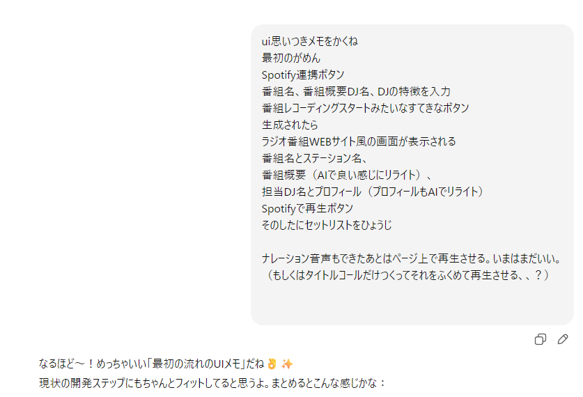
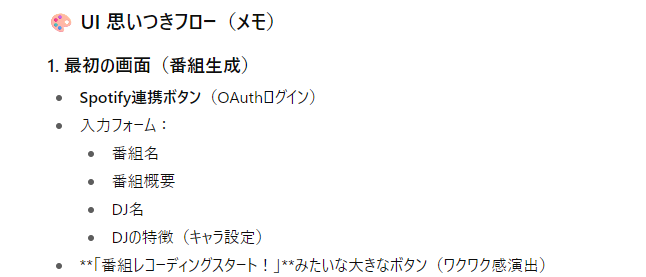
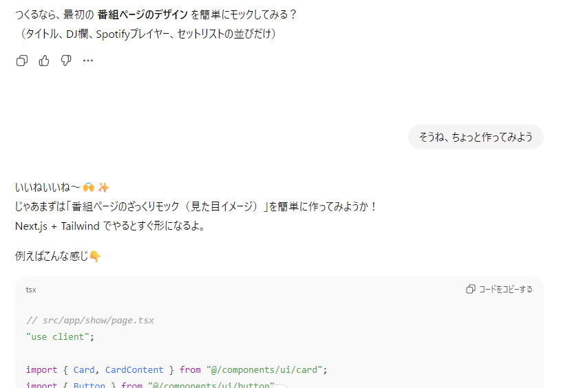
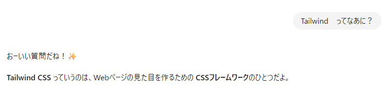
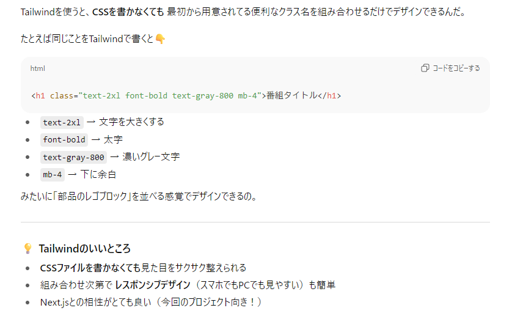
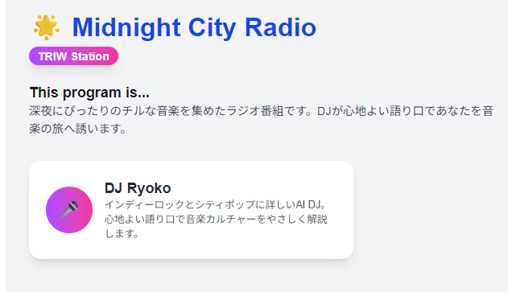
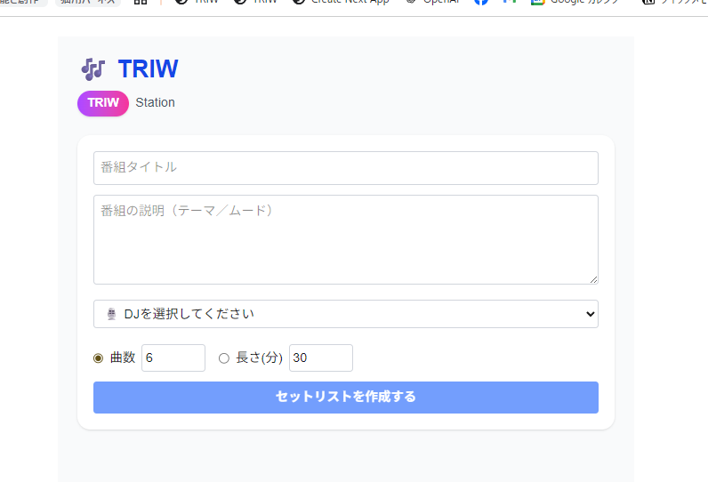

# 8. 機能を絞ることにした（8月後半）
## DJによる選択機能を詰めていく
新たに思いついた DJペルソナ機能が行けそうかを試してみることにします。
これ、LLMが選ぶわけだから、ChatGPTを相手にテストすりゃいいわけです。というわけで机上テストをまず行います。
プロンプトを投げるテストだけを単体で行います。これはべつにコードいらないからすぐできる。
そしたらけっこうこれがいけそうでおもしろそうなことがわかりました。

次にコードを出してもらい、実際にローカルサーバーで動かしながらテストを進めました。
思考過程をJSONに出してるので、どこがうまくいかないのかを確認できます。
それで番組テーマとDJのキャラを両立させるための仕組みをいろいろと考えていきました。この過程はすごく面白いね。
ただ、細かくやってったらだんだん重くなっちゃった。

8月25日には、一旦の目標をプレイリストの作成だけに絞って開発を進めることを決定しました。当初の音声化はまた後にして、とりあえずここまでで区切りをつける。自分が飽きないうちに、まずは形にすることを優先することにしました。

## はじめてのUI作成
形にするためにはUIが必要です。いまは最低限の見た目しかないので、もう少しかっこよい見た目にしたくて相談しました。
 

  

 

  

 こんな感じで要件をまとめていってもらいます。

 だいたい納得したのでコードに落とそうとしたら、Tailwindというものがでてきた。
 

  

 当然よくわからないから聞いてみます。

  

  

 よさそうなので入れてみます。
 なるほどー、ライブラリがいろいろあるのか便利だな。
 

 なんとなく形になってきたぞ!（8/25）

  

 DJも増やしていろいろとチェックしていきます（8/28）

  

うん、楽しいぞ！　1週間に1回くらい、できた！感があるとモチベーションが保てますね。
