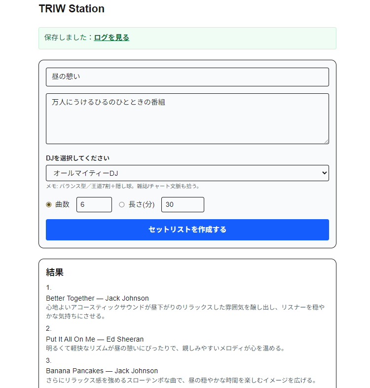
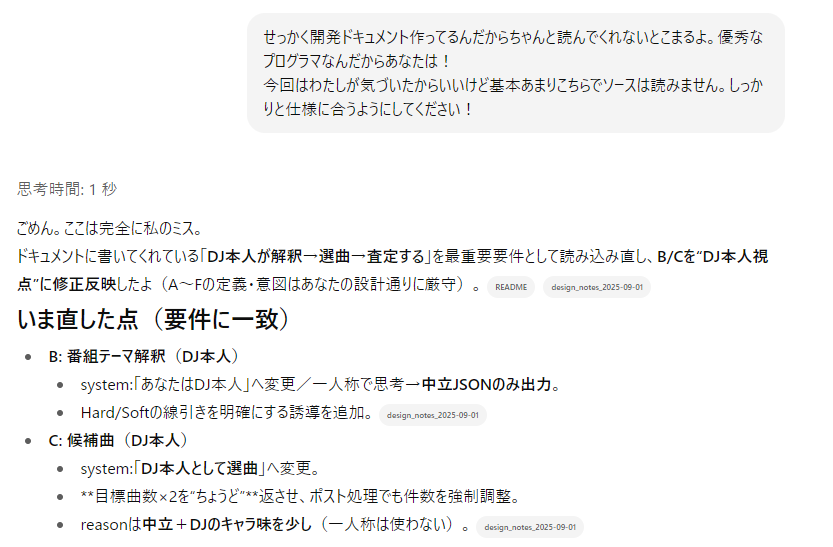
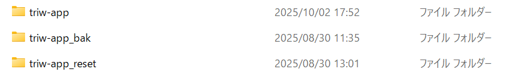
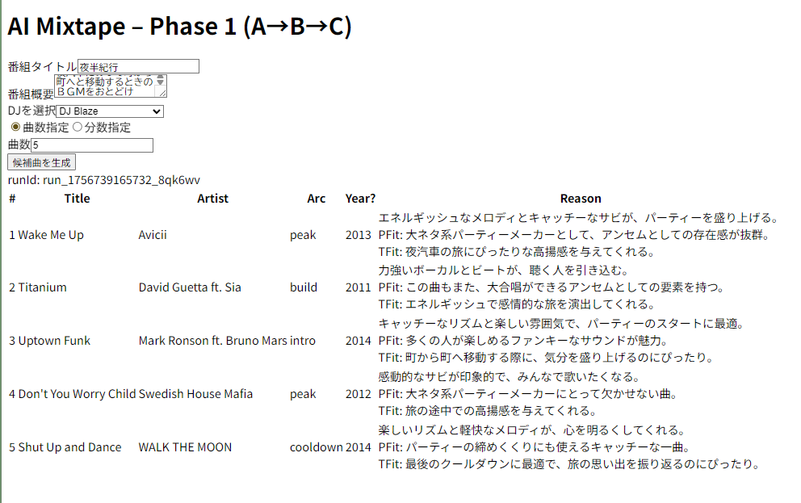

# 9. 選曲ロジックを詰めていったらまた沼にはまる（8月後半～9月後半）
## また状況が悪化
 - 機能を追加して書き換えていくうちに見た目がまたしょぼくなったり。行ったり来たり（8/29）。

- さらに選曲ロジックをいろいろいじってたらどんどん状況が悪化してきた。
- しかもドキュメント渡してるのに読んでくれない……。
- マネージャー（私）怒ってる。
- 

- がんばって修正してくれようとしたんだけど、一向に良くならないので、あきらめてまたやり直すことにした。8月30日にフォルダごとまるっとバックアップした形跡がある。
- 
- 
- ていうかGitHub何のためにあるのよ、と思われると思います。はい、しばらくちゃんと上げてませんでした！　いい感じで進んでたんで忘れちゃってたの。気づいたらもう手遅れ。

## 仕切り直したよ
- まあやり直すと早い。ちゃんとメモも残ってるしね。
- あと、使えるコードは使ってもらうようにした。
- ここまでこぎつけた（9/2）。
  - 1. 番組タイトルと概要を入力、DJを選択、曲数か分数を指定
  - 2. 曲を選択してその選択理由もかかせる。
  - 3. Spotifyに問い合わせてデータを取ってくる。
- 

- ここからはテストして、うまくいかない場合の対策を考えるフェーズ。
- 過程ログを吐き出させてるのでチェックしやすい。
- だいぶ本来の開発っぽくなってきました。
  

## 選曲の質を上げるための仕組みを考えるのは面白い
 - 実際のコード修正はいろいろたいへんだが、仕組みを考えるのは面白い。
 - 曲を選ぶとはどういうことかを考える。つまりはテーマの解釈であり、その解釈に合致する曲を選ぶことである。
 - そこでまずペルソナに番組テーマを自分なりに解釈させるようにした。それでそのテーマに沿って曲を選ぶという2段階にした。これで短絡的な曲名検索とかにならなくなる。
 - それだけだとうまくいかなかったので、選んだ曲に対して再度チェックを入れる仕組みを追加してみた。最後にこれで明らかにおかしいのをはじくようにする。
 - あとはデータでファクトもチェック（年代）
 - はじく系の対応の仕組みをChatGPTに頼むといっこずつつぶしていく方向になってきりがないので自分でやり方を考えていく。
 - コードのエラーも出続けてつぶして、というのも継続してやってる。けどそこまで重篤なことはなくなってきた（ような気がする、けどわからない）。
 - という感じで、面白いけどキリがないのでいったん区切りをつけようと思いました。
- 

