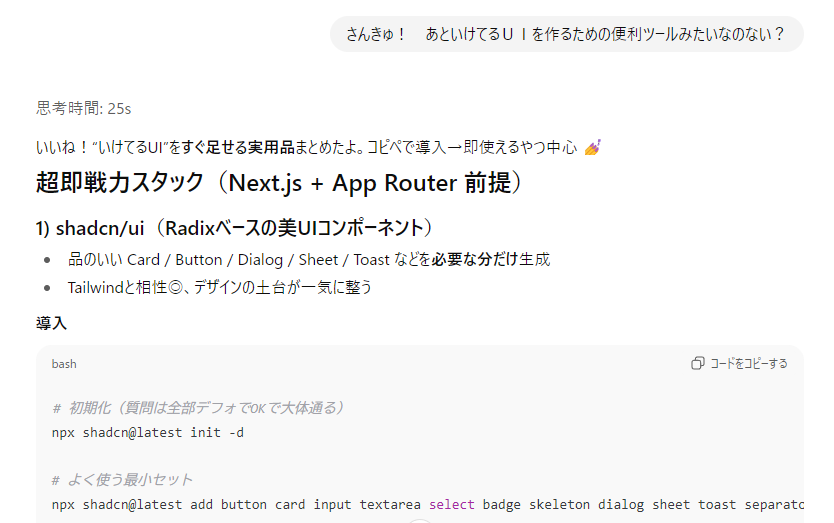
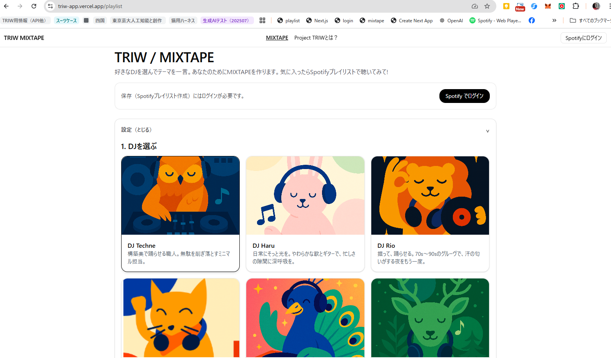

# 10. ついにリリース（9月後半～10月頭）
## 再びUIを付けよう
  ちょっと品質向上にも疲れてきたのでリリース（テスト）をしようと思いました。
  開発しなおしてからは完全テストモードなのでUIは何もついていません。
  前にやったのは忘れてるのでまた聞いてみます。
 
  
 導入手順を出してもらって手順道理実行。コードをコピペ。枠は順調にできました。
 
DJを選ぶところで、イラストが入ったらよさそうだったので、下絵を手がきしてからAIに清書してもらって、別パターンも作ってもらって画像を作成しました。
もと絵はなぜか見当たらないけど、これが清書してもらった猫DJです。

これの別動物バージョンも作ってもらいました。

## Spotify認証も再確認
  自分以外が使うことを考えて、Spotifyのログインとログアウトボタンもつけておきます。またここではまるんじゃないかとドキドキでした。

## ローカルでは形になった
UIが付いただけなので、テスト段階とほぼ同じではありますが、127.0.0.1にアクセスするとUIがそれらしく表示されて一通りは動くようになりました。
いろいろ入れてたら動作がだいぶ重くなっちゃったり、できたプレイリストの品質が満足できなかったりはあるけどいったん動きとしては問題なさそう。

## いよいよサーバーで公開
  さて！　ついにサーバー公開です。
  だいぶ前に、サーバー公開するときはどうするか聞いたらVercelというものならGitHubからすぐ上げられるといわれていたのでそれでやってみます。

  実際やってみたら、やはりエラーがどんどん出ました。たぶん、これいま使ってないコードも上がってるな……。
  ちょっとこころが折れそうになりながらも、ChatGPTに修正コード出してもらいつつついにエラーがゼロになり、<b>デプロイ</b>できました。ここはトラブルというより、ほんとにひとつずつひとつずつ修正しただけでした。

  しかしその感動もつかの間。家族に動かしてもらったらさっそく、Spotifyの認証エラーが出ます。
エラーが出たとChatGPTに聞いたら、それはSpotifyのAPIがデベロッパーモードだからではないかと言われました。デベロッパーモードの場合は上限があり、ユーザーのメールアドレスを事前に登録しておかないとだめなんだそうです。これはサービス申請を行うことで撤廃できるらしい。登録のための文案（英語文）はChatGPTが出してくれたので、もう少し改良したら登録してみよう。

認証はSpotify側の登録の問題だったので、アドレス登録しただけで無事解決できました。
やった！！！外からも動いたぞー！

## 今後
数人の友だちにもテストしてもらいました。
外部で動かすと、やっぱり問題がいろいろ出てきます。
まず一番の問題が、途中ログが保存されないことです。生成ログを保存することができていないので、テストをしても改善に生かせません。これは早急に改善しないと。

あと適切なDJを選ぶことによる効果が伝わりづらい。プレイリストがぜんぜん思ったようにできないよ、と言われました。DJとミックスタイトルがはまればいい感じにできるはずなのです。

まあでもとりあえずはなんとか動いたのはうれしい！
ひきつづきがんばります！ 

