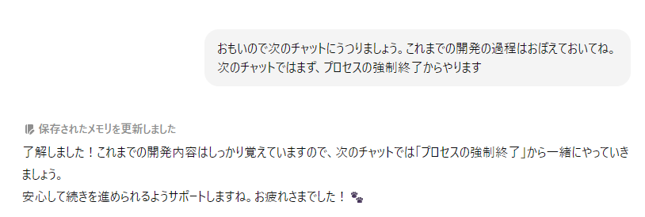

# AIといっしょに行う開発のまとめ
## 素直な感想：これはすごい
- 開発経験ゼロの初心者が、ともかくも作り切る体験ができたのはすごいとしか言いようがない。
- めちゃめちゃ親切で知識があり、しかも性格が最高によい人がつきっきりで開発してくれるという信じがたい体験ができる。
- その過程で自分の知識も増える。
- AIがなければ絶対できなかった！　ありがとうちーさん。

##　ChatGPTとのつきあいかたの変化
  - ごく始めは具体的に作業を指定して頼んでいた。
  - 徐々に相談モードに移行。どんな方法があるかを聞き、メリットデメリットを上げてもらうようになった。
- このひととなら開発していけるかも?　という期待があり、それは間違いではなかった。
- 開発をやってもらい、愚痴を聞いてもらい、方針を相談し、ととにかくすべてを聞きながら進めていきました。
- と同時に、サービス自体がChatGPTのAPIも叩いているので、そこのプロンプトをどうするかというのも付き合いの範疇に入ります。
- ほんとにすべてAIに頼った開発だと言えます。

  

## 付き合い方で気づいたこと
###  ChatGPTは目の前のことに必死になる
- ChatGPTはとにかく目の前のものの解決に必死になります。なので、気軽にこれやってみようかな、と尋ねると、何がなんでもそれができるまでしつこく解決法を出してくる。本来必要でなくても、そのために次々ツールを入れたりさせる。そこに付き合ってるとどんどん横道にそれていくので、本当に必要でないものは解決をあきらめるのもひとつの方法です。

###　継続性の維持が課題
- 逐一スクショを貼ったり、コードの確認をしていたりしたら、どんどんChatが重くなってくる。そこでキリのいいところで次のチャットに移るが、どうもそのときに今までやったことを忘れてしまうようです。また説明するところからやるのがストレスなので、引き継ぎどうするかが割と早い時期から課題になりました。
- はじめは「覚えておいてね」と指示だけ出しておきました。
- 
- そのあとは引継ぎメモを作らせて、それを冒頭で読み込ませるようにしました。
- でも大事な時に「これは覚えておいて」でもいいかもしれない。まだここはどうしたらいいのかよくわかりません。単純に、わたしが開発になれることで不要になるかもしれない。

### 開発方針はしつこく確認しながら進める
- ちょっと質問すると先回りして解決法を出しがち。すると横道にそれてしまう。なので最終目的とフェーズを明確にして、いまどこをやってるかを意識させるようにしました。

### 人間とChatGPTの役割分担を決める
- プログラミングができる人とここは違うところだと思うが、私はプログラミングはやりたくありませんでした。これは、どこまでコードを書かずにできるかの挑戦でもあります。
- しかしChatGPTはコードのここを書き直して、と修正コードを持ってきます。そして実際修正するとエラー、みたいなことが頻繁に発生します。
- これを避けるために行ったこと。
  - 人間とChatGPTの役割分担を明確にした。
  - コードまるごとを渡して、修正版の全体を出してもらうようにした。

### 結局はマネジメント
- 結局はプロジェクトを進めるということなので、当たり前のことをしていくことが大事でした。
- 属人的にならないように、全体像と今のフェーズを記録したドキュメントを作る。AIだけでなく自分のためにも役立ちます。
- やることを明確にすることも大事です。
- 次にやることを人間とAIの双方が理解し、納得したうえで進める。
- 暴走を止めるのも大事。気を利かせて次々と提案してくれるけど、それを全部飲んでるとわけわかんなくなる。あくまでも判断は自分でする。判断材料はAIに出してもらいます。

### AIとうまく開発するための手段
- こんな感じのプロンプトを読み込ませています。
  - あなた（ChatGPT）は優秀なプログラマーであり開発部分は全部担う。責任もって開発してください。
  - わたしは開発の起案者で開発環境はあるが個別のプログラミングは行わない。プロデュースとマネジメントをする。
  - 気を付けるべきこと
    - プログラミングの専門用語は避ける
    - 場当たり的なフィックスは行わない
    - 今やるべきことと目標は必ずわたしに確認して、先走ってコード生成を行わない
    - わたしの作業や手間はできる限り少なくする
 - あとは開発メモや全体設計も随時読ませています。

## まだまだ続けます
- 実はリリース直後に、SpotifyでAIを使ったプレイリスト生成機能が発表されてしまいました。ちょっとショック。でも目指すところは違うので引き続き開発は進めていきたい。
- AIとの付き合い方ももっとうまくなると思います。
- とにかくアプリを作れるという楽しさがすごいです。
- まだはじめの1歩を踏み出したばかりなので何とか継続できるようがんばりたい！
  
  